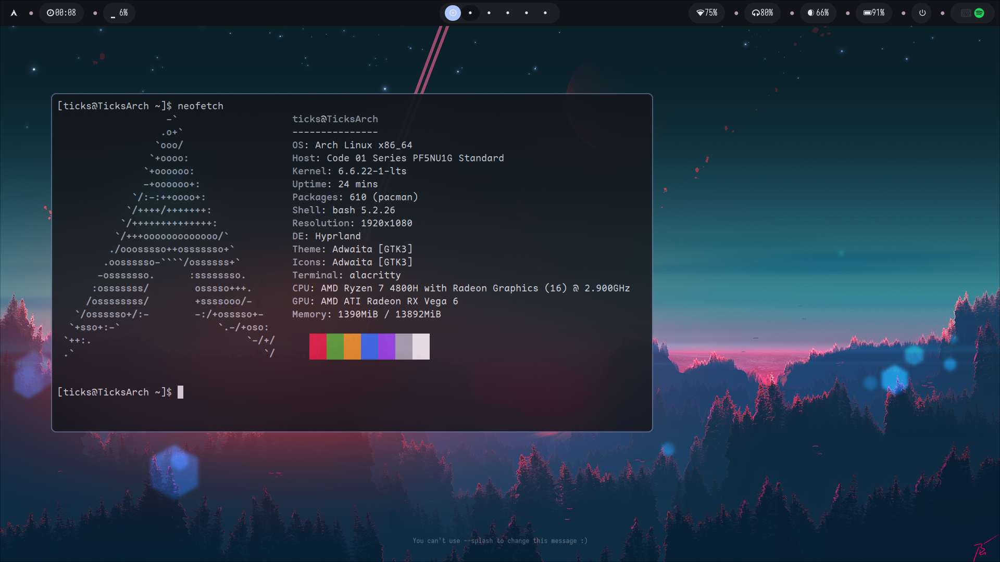
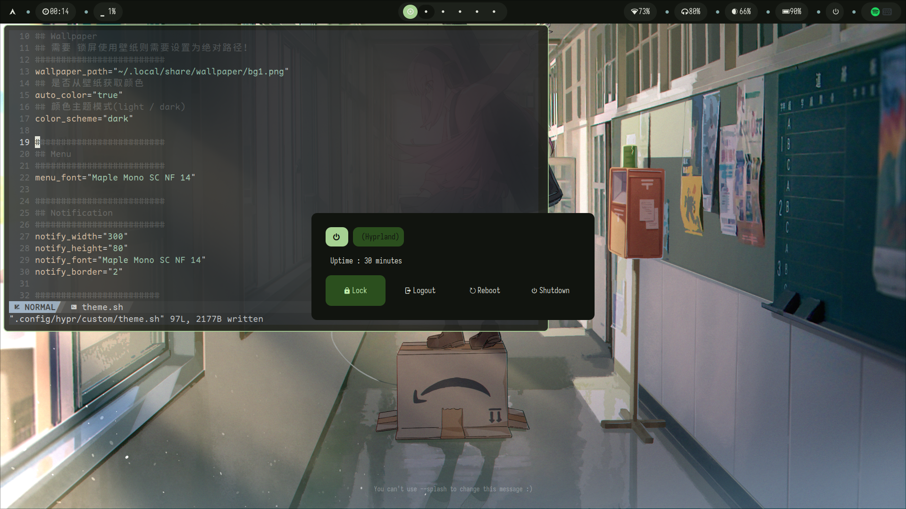
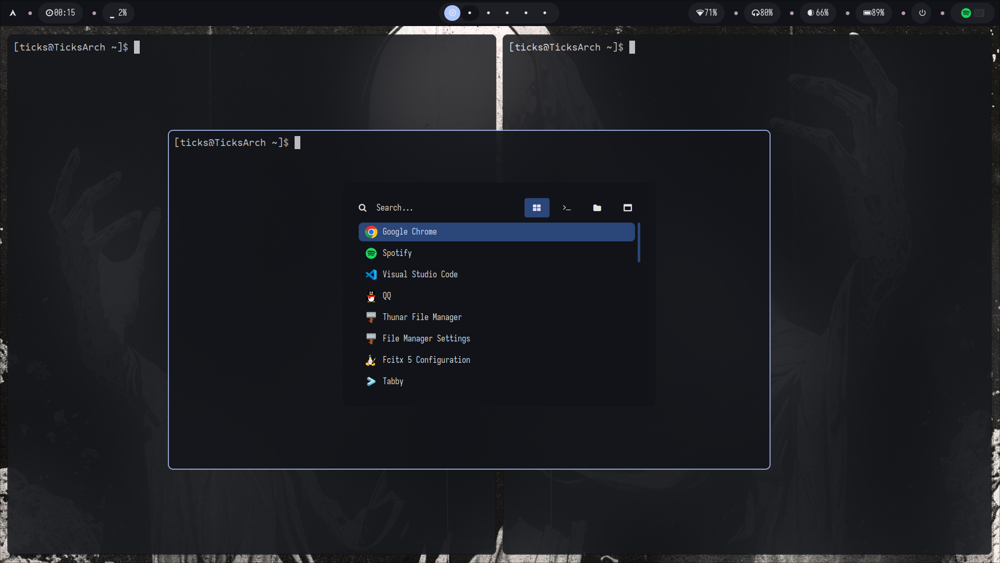

## ArchLinux 自用Hyprland配置

### 截图：







### 安装要求

- **基础软件**：`hyprland` `xorg-xwayland` `qt5-wayland` `qt6-wayland` `glfw-wayland`
                `xsettingsd` ...

- **壁纸**：`hyprpaper`

- **状态栏**：`waybar`

- **启动器**：`rofi-wayland` 或 `wofi`

- **通知**：`dunst`

- **剪切板**：`wl-clipboard` `cliphist`

- **截屏**：`slurp` `grim` `jq`

- **密码认证**：`xfce-polkit`

- **取色**：`hyprpicker`

- **声音**：`pipewire` `pipewire-alsa` `pipewire-audio` `pipewire-pulse`

- **亮度**：`light` `xbacklight`

- **录屏**：`obs-studio` `wireplumber`

- **锁屏**：`swaylock` `swayidle`

- **终端**：`alacritty`

- **音乐**：`mpd` `ncmpcpp` `mpc`

- **网络**：`networkmanager` `wpa_supplicant`

- **文本编辑器**：`neovim` `geany`

- **主题**：`qt5ct` `kvantum` `gsettings-desktop-schemas`

- **字体**：`Symbols Nerd Font` `JetBrains Nerd Font` `Sarasa UI SC` `Iosevka Nerd Font` `Hack Nerd Font`

- **动态取色**： `python-pywal`

### 安装说明

大部分软件都可以在Archlinux官方仓库下载到，字体请到下方链接下载或者仓库 fonts 目录下下载：

Sarasa: https://github.com/be5invis/Sarasa-Gothic

Nerd Font: https://github.com/ryanoasis/nerd-fonts

LXGW: https://github.com/lxgw/LxgwBright

rofi 请使用 `rofi-lbonn-wayland` 

正式使用前请保证安装好对应字体，字体中包含了很多图标显示。仓库`other`下其他目录为非必需配置文件，可根据自身情况选择性使用，直接复制对应目录到 `~/.config/` 下即可。

### 安装步骤：

1. fork 仓库

```bash
git clone --depth=1 https://github.com/ticks-tan/wayland-dotfile
cd hyprland-dotfile
```

2. 备份原有配置

```bash
mv ~/.config/hypr ~/.config/hypr-back
```

3. 拷贝配置

```bash
cp -r hypr ~/.config/

## 拷贝其他配置
cp -r other/xxx ~/.config/xxx

## 如果需要壁纸动态取色，必须拷贝 other/wal 到 ~/.config/ !!!
cp -r other/wal ~/.config/
```

4. 启动 hyprland 查看效果

### 主题

配置使用脚本可以进行简单的主题配置，主题配置文件在 `hypr/custom/theme.sh` ，内部变量有注释说明，可以定制配色、字体和一些其他选项。

最好情况是你可以很好的的使用此配置，修改完文件后使用 `Mod + T` 进行运用，脚本会自动刷新配置并重新加载 `hyprland` 。当然你也可以自定义更多选项，应用脚本在 `hypr/custom/apply.sh` ，主要都是一些字符串替换，可以自行定制。

第一次使用请先进行主题配置，默认主题你可能没有安装！

默认配色、GTK主题、光标主题均为 `catppuccin` ，可以到 [此处](https://github.com/catppuccin/catppuccin) 查看关于 `Catppuccin` 所有配色主题 。

### 键盘绑定

下面是一些主要的绑定，具体请查看 `hyprland.conf` 
| 键 | 绑定操作 |
| ---| ---|
| Mod + Shift + Q | 退出Hyprland |
| Mod + Return | 普通模式启动终端 |
| Mod + Shift + Return | 启动浮动窗口终端 |
| Mod + Alt + Return | 全屏启动终端 |
| Mod + P | 取色 |
| Print | 区域截图 |
| Alt + Print | 当前显示器截图 |
| Shift + Print | 选择窗口截图 |
| Mod + Shift + S | 区域截图 |
| Mod + A | 应用启动器 |
| Mod + R | 运行程序 |
| Mod + Shift + R | Root运行部分程序 |
| Mod + Shift + X | PowerMenu菜单 |
| Mod + Shift + N | 网络小部件 |
| Mod + Shift + M | 音乐小部件 |
| Mod + T | 应用主题变更 |
| Mod + C | 关闭应用 |
| Mod + Shift | Space | 切换平铺与浮动 |
| Mod + 鼠标| 移动或调整窗口 |

###  其他

当前配置部分脚本功能和rofi配置参考自 [Archcraft](https://archcraft.io/) bspwm 配置，欢迎下载Archcraft体验。

终端小猫咪：[https://github.com/andreasgrafen/pfetch-with-kitties](https://github.com/andreasgrafen/pfetch-with-kitties)